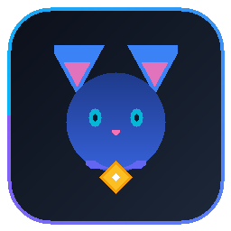

# CatTags

> **Team identity, everywhere.**  
> Persistent, externally registered team identity and styling system for **Minecraft Java Edition 1.21.11 (Fabric)**.



---

## Overview

CatTags is an open-source Minecraft team identity platform that connects in-game players with custom team tags, gradients, and logos managed through a modern web dashboard.

When a team registers on CatTags, any player running the CatTags Fabric mod automatically sees custom styled nametags, tab list entries, and optional badges for team members—without requiring server plugins or Microsoft OAuth.

### Key Features
* **Minecraft 1.21.11 Fabric Mod**: Seamless client-side rendering above player heads and in tab list.
* **Offline & Cracked Compatible**: Designed for offline/cracked networks without Microsoft OAuth constraints, utilizing an in-game verification token system (`/team verify <token>`).
* **Advanced Style Engine**: Full support for Solid colors, two-color linear gradients, multi-color gradients, and dynamic rainbow cycling.
* **High Performance Caching**: Persistent disk and in-memory LRU caching (`.minecraft/config/cattags/cache/`) with batch resolution (`POST /api/v1/players/resolve`) to ensure zero render frame drops.
* **Zero Crash Guarantee**: Graceful offline fallback—if the backend is unreachable, the mod seamlessly continues using cached data.
* **Modern Web Dashboard**: Real-time interactive Minecraft nametag preview (`[NOVA] Steve`), team registration, member management, and appearance customizer.
* **Render-Ready Backend**: Node.js/TypeScript REST API with PostgreSQL database migrations, rate limiting, and Docker support.

---

## Monorepo Architecture

```
cattags/
├── mod/               # Fabric 1.21.11 Minecraft mod (Java 21, Loom, Mixins)
├── backend/           # Node.js/TypeScript REST API (PostgreSQL, migrations, Docker)
├── web/               # React / Vite / Tailwind web dashboard with live preview
├── shared/            # Shared TypeScript data models, types, and constants
├── docs/              # Comprehensive technical and architecture documentation
├── .github/workflows/ # GitHub Actions CI/CD (build, test, release)
└── render.yaml        # Render Blueprint (Web Service + Managed PostgreSQL)
```

---

## Brand & Visual Theme

CatTags follows a dark-first, modern esports/developer aesthetic:
* **Night Background**: `#080B12`
* **Electric Blue (Primary)**: `#3B82F6`
* **Deep Blue (Dark Primary)**: `#1D4ED8`
* **Light Blue (Bright Primary)**: `#60A5FA`
* **Surface Panels**: `#111827`
* **Elevated Surfaces**: `#172033`
* **Subtle Borders**: `#1F2937`

---

## Quick Start

### 1. Requirements
* **Java**: OpenJDK 21 or newer
* **Node.js**: v20.x or newer & npm
* **Gradle**: 9.7+ (or bundled wrapper)

### 2. Backend & Web Dashboard Setup
```bash
# Install root workspaces dependencies
npm install

# Build shared models
npm run build --workspace=shared

# Start backend in development
npm run dev --workspace=backend

# Start web dashboard
npm run dev --workspace=web
```

### 3. Fabric Mod Setup
```bash
cd mod
gradle test
gradle build
```
Compiled mod JAR is located at: `mod/build/libs/cattags-1.0.0.jar`.

---

## In-Game Commands

| Command | Description |
|---|---|
| `/cattags status` | View connection state and cached team count |
| `/cattags reload` | Reload configuration and team database from disk |
| `/cattags clear` | Clear local team and player caches |
| `/cattags resolve <player>` | Force-lookup a player's team identity immediately |
| `/team verify <token>` | Verify player identity for cracked/offline server claims |

---

## Environment & Security Configuration

CatTags incorporates enterprise-grade security including Better Auth, Cloudflare Turnstile bot protection, Resend transactional emails, and strict rate limiting.

### Required Environment Variables

Copy `.env.example` to `.env` and configure:

| Variable | Required | Description |
|---|---|---|
| `JWT_SECRET` | **YES** | Minimum 32-character secret for legacy and JWT signing. The server **refuses startup** if missing. |
| `BETTER_AUTH_SECRET` | **YES** | Secret key used by Better Auth session encryption. |
| `BETTER_AUTH_URL` | **YES** | Root API origin (e.g. `http://localhost:8080` or `https://cattags-api.onrender.com`). |
| `DATABASE_URL` | Production | PostgreSQL connection string (`postgresql://...`). In-memory SQLite/Memory fallback used for tests. |
| `TURNSTILE_SECRET_KEY` | Recommended | Cloudflare Turnstile secret key for verifying CAPTCHA challenges. |
| `VITE_TURNSTILE_SITE_KEY` | Recommended | Cloudflare Turnstile public site key embedded in the frontend forms. |
| `RESEND_API_KEY` | Recommended | Resend API key (`re_...`) used to send verification and security emails. |

#### Cloudflare Turnstile Setup
1. Log into your [Cloudflare Dashboard](https://dash.cloudflare.com/) and navigate to **Turnstile**.
2. Add a new site with your domain(s) (`cattags.xyz`, `localhost`).
3. Copy the **Site Key** to `VITE_TURNSTILE_SITE_KEY` in `web/.env` and **Secret Key** to `TURNSTILE_SECRET_KEY` in `backend/.env`.
4. *Local Testing Keys*: Cloudflare provides dummy test keys that always pass:
   - Sitekey: `1x00000000000000000000AA`
   - Secret: `1x0000000000000000000000000000000AA`

#### Resend Email Verification Setup
1. Sign up at [Resend.com](https://resend.com) and create an API key with sending permissions.
2. Verify your sending domain or use test domains in sandbox mode.
3. Set `RESEND_API_KEY=re_...` in your server environment.

---

## API Reference

* `GET /api/v1/health` — Unauthenticated health check endpoint
* `GET /api/v1/version` — API version and loader compatibility
* `GET /api/v1/config` — System limits, allowed logo formats, and TTL
* `POST /api/v1/auth/register` — Better Auth registration with Turnstile verification and rate limiting (10 req/15m)
* `POST /api/v1/auth/login` — Better Auth authentication with Turnstile verification and rate limiting (10 req/15m)
* `POST /api/v1/players/resolve` — High-efficiency batch player lookup
* `GET /api/v1/teams` — Paginated directory of registered teams
* `GET /api/v1/teams/:id` — Team details with ETag caching
* `POST /api/v1/teams` — Authenticated team creation (requires verified email & Turnstile)
* `PATCH /api/v1/teams/:id` — Update team appearance, prefix, and colors (Owner/Admin only)
* `POST /api/v1/teams/:id/logo` — Upload team logo (magic byte validated PNG/WebP, Owner/Admin only)
* `POST /api/v1/teams/:id/members` — Add member to team (Owner/Admin only)
* `POST /api/v1/teams/:id/verify` — Generate cracked/offline verification token (cryptographically secure hex, Owner/Admin only)
* `POST /api/v1/teams/:id/verify/confirm` — Consume in-game verification token and verify team membership

---

## Deployment (Render)

CatTags includes a validated Render Blueprint (`render.yaml`):
1. Connect this GitHub repository (`itz0cat/cattags`) to your Render account.
2. In Render, select **Blueprints** -> **New Blueprint Instance**.
3. Render automatically provisions the `cattags-api` Web Service and `cattags-db` PostgreSQL instance.
4. Migrations run automatically on startup via `npm run migrate`.

---

## License

Released under the [MIT License](LICENSE).  
Created by **ItzCat**.
